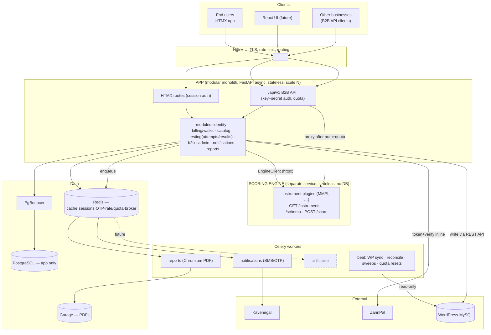
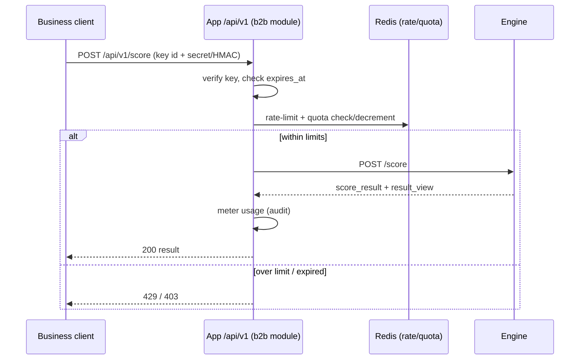

# Psychology Test Platform — Architecture & Plan (v2)

*FastAPI · HTMX · Celery/Redis · PostgreSQL · Garage · Docker Compose · Nginx, plus a standalone
stateless **Scoring Engine** service.*

This revision extracts the scoring engine into its own service (plugin-per-instrument, API-first),
adds a **B2B API** product with key/quota management, and confirms username/password **and** OTP
login with OTP recovery. Keycloak OIDC is deferred to the very end.

---

## 0. Service boundary (the one big decision)

A **modular monolith** holds everything transactional; **one stateless service** is extracted.



**Why the engine is the right (only) thing to extract:** it's pure compute, shares no DB
transaction, and has three consumers (app, B2B, React). **Why billing isn't:** the wallet debit is
one atomic transaction; splitting it across the network makes it a distributed-transaction problem.
The engine never reads the app DB; the app calls it via `EngineClient`. Public ingress is the app
only — the engine is internal.

---

## 1. The Scoring Engine

### 1.1 Instrument plugin contract
Each instrument is a code module with arbitrary internals behind one interface:

```python
# engine/instruments/base.py
class Instrument(Protocol):
    slug: str
    version: int
    def metadata(self) -> InstrumentMeta: ...         # title, demographics[], page_size
    def question_schema(self) -> QuestionSchema: ...   # items: id, (scale?), text, options[{value,label}]
    def score(self, responses: dict, demographics: dict) -> ScoreResult: ...   # arbitrary logic
    def build_result(self, score: ScoreResult) -> ResultView: ...
```

`ScoreResult` = `{raw: dict, derived: dict}` (instrument-specific). The **unifying output** is:

```python
# engine/result_view.py
@dataclass
class ResultView:
    kind: str                 # "profile" | "type" | "index" | "themes"
    summary: str
    items: list[ResultItem]   # {key, label, value, band?, severity?}
    interpretation: list[Block]  # {title, body, severity?}
    chart: ChartSpec | None   # {type: line|bar|radar|gauge, series, axes, reference_lines}
    meta: dict                # slug, version, scored_at
```

This single shape lets HTMX, React, and the PDF report render **any** instrument with no per-test
view code. New families just pick `kind` + `chart.type`.

How the named instruments map (for intuition): **MMPI** → kind=profile, line chart, T-score bands.
**MBTI** → kind=type, no chart (or 4 dichotomy bars), forced-choice items. **NEO** → kind=profile,
facets rolled into domains, radar/bar. **Gardner** → kind=themes/profile, ranked intelligences,
radar. **Strong** → kind=themes, interest themes + matches. Each is one plugin; none shares the
others' logic.

### 1.2 MMPI plugin (first instrument, preserve exactly)
Wrap the verified logic from `mmpi.html`/`mmpi_v1.json`: option-weight raw sums (yes=1/no=0, flipped
for the 11 reverse items), gender-norm T-scores `round(50+10z,2)` (JS half-up), validity flag T>60,
clinical bands T≥65/≥70, and `build_result` → ResultView(kind="profile", line chart with reference
lines 50/65/70 and the K|Hs divider, validity vs clinical series). The engine's **equivalence test**
(5000 random respondents vs the original logic, 0 divergence) is a release blocker.

### 1.3 Engine API (internal + the basis for B2B)
- `GET /healthz`
- `GET /instruments` → `[{slug, version, title}]`
- `GET /instruments/{slug}/schema?version=` → InstrumentMeta + QuestionSchema
- `POST /score` → `{slug, version, responses, demographics}` → `{score_result, result_view}`

Stateless; plugins discovered at startup; its own Dockerfile, tests, and Compose service.

---

## 2. Data model (app owns all state; engine owns none)

Core (unchanged from v1): `users`, `organizations`, `org_members`, `wallets`, `ledger_entries`,
`tests`, `test_versions`, `entitlements`, `payments`, `attempts`, `responses`, `scores`,
`interpretations`, `reports`. Changes/additions:

- **users**: + `password_hash` (nullable), `external_idp`, `external_sub` (nullable, Keycloak seam).
- **test_versions**: + `instrument_slug`, `instrument_version` (link to engine plugin) and keep
  `price_cents`, `currency`, `is_active` (commerce). The heavy definition now lives in the engine
  plugin, not the DB.
- **attempts**: store `instrument_slug` + `instrument_version` used (reproducibility), `demographics`
  (JSONB), `responses` (JSONB).
- **scores / interpretations**: store the engine's `ScoreResult` and the `ResultView` (JSONB);
  `interpretations.source` ∈ {'rule','ai'}.

### B2B tables (separate module/schema — NOT users/wallet)
- **api_clients** — `id, name, contact, status, created_at`
- **api_keys** — `id, client_id, key_id (public), secret_hash, status ('active'|'revoked'),
  rate_limit_per_min, quota, quota_period ('day'|'month'), expires_at, created_at, last_used_at`
  *(rate_limit / quota / quota_period / expires_at are each independently configurable)*
- **api_usage** — `id, key_id, window_start, count` (+ append-only request log for audit)
- (optional **api_contracts** — `client_id, starts_at, ends_at, quota` if contracts outlive keys)

Rate limiting + live quota counters run in Redis; durable usage/audit in Postgres; Beat resets quota
windows.

---

## 3. Authentication (app users)

Two login methods + recovery, all funneling through one seam:

```mermaid
flowchart LR
    P["password login"] --> ES
    O["phone+OTP login"] --> ES
    REC["OTP password recovery → set new password"] --> ES
    OIDC["Keycloak OIDC callback (future)"] -.-> ES
    ES["establish_session(user)\n(Redis session + cookie)"] --> S["authenticated"]
    classDef f stroke-dasharray:5 5,stroke:#94a3b8,color:#94a3b8; class OIDC f;
```

- Username/password (hashed, argon2/bcrypt) **and** phone+OTP both available.
- OTP recovery: purpose-tagged 'reset' code (separate from 'login'), no enumeration, invalidates
  sessions on reset. Hard per-phone + per-IP rate limits, per purpose.
- `establish_session` is the single chokepoint — the thing that makes Keycloak a drop-in later.

---

## 4. B2B API product

A second public surface so other businesses (and your future React UI) can use scoring under
contract, fully separate from the consumer billing system.



- **Public endpoints** mirror the engine: `/api/v1/instruments`, `/api/v1/instruments/{slug}/schema`,
  `/api/v1/score`. The engine itself stays internal; the b2b module is its only external gateway.
- **Auth:** API key id + secret (header, ideally HMAC-signed request); secret stored **hashed**.
- **Limits:** per-key rate limit, quota, period, and expiry — each set independently.
- **Admin (management) JSON API** (not HTMX): `POST /admin/api/clients`, `POST /admin/api/keys`
  (returns the secret once), `PATCH` to adjust limits/expiry, `POST .../revoke`. Admin-authenticated.
- First-party React can use the same `/api/v1` with a first-party key, or session/JWT — decide when
  React is built; the surface already exists either way.

---

## 5. Billing & pricing, WordPress sync, Reports, AI

- **Billing/pricing:** entitlement primitive + atomic wallet debit + append-only ledger (unchanged);
  per-test price lives on `test_versions`, admin-editable, read by billing. Individual pay-per-exam
  and org wallet/allocation both produce entitlements.
- **WordPress sync (bidirectional):** read via read-only MySQL, write via WP REST API only; phone is
  the join key; last-modified-wins; loop-prevented; off the request path. cPanel connection guide is
  in PHASE_PROMPTS.md.
- **Reports:** Playwright/Chromium HTML→PDF, **generic over ResultView**, RTL/Vazirmatn, Garage +
  signed URLs, isolated `reports` worker.
- **AI:** future `ai` worker writes `interpretations(source='ai')` from the ResultView — zero schema
  or web change. Explains, never diagnoses.

---

## 6. Frontend & design (app)

HTMX server-rendered partials; result pages render generically from ResultView (chart type from the
spec). Clinical, minimal, RTL, Vazirmatn; palette from brand `#00a379` with severity colors encoding
bands (ok / caution T≥65 / severe T≥70). Footer + logo slot on every page. React, when built, is a
separate client of `/api/v1` — not part of this app.

---

## 7. Deployment

```yaml
# services (compose) — one app image, one engine image
services:
  app:        # gunicorn/uvicorn — HTMX + /api/v1 + /admin/api
  engine:     # the scoring engine service (own image; bundles plugins; pytest incl. equivalence)
  worker-notifications: # celery -Q notifications
  worker-reports:       # celery -Q reports (Chromium)
  beat:                 # celery beat
  nginx: postgres: pgbouncer: redis: garage:
  # worker-ai added later; keycloak added last
```

The engine is a distinct service from day one (that's the whole point), reachable only inside the
compose network; Nginx exposes the app (HTMX + `/api/v1`) but not the engine.

Security posture (minors' data): column encryption at rest; audit logging on results/reports/resets/
WP writes/B2B calls; secrets in env/Infisical; WP creds read-only; API secrets hashed; PgBouncer txn
pooling; stateless app scales by replicas.

---

## 8. Phased plan (summary — prompts in PHASE_PROMPTS.md)

Done: 0 skeleton, 1 catalog + verified MMPI logic.
**A** Scoring Engine service + MMPI plugin (**first; standalone, tested**) → **2** Identity + OTP →
**3** Username/password + OTP recovery → **4** WP bidirectional sync (+cPanel guide) → **5** Test flow
(consumes engine) → **6** Billing + dynamic pricing → **7** Reports → **8** B2B accounts & keys
(admin API) → **9** Public B2B scoring API → **10** Admin panel (HTMX) → **11** Hardening → **AI** →
**Keycloak OIDC (last)**.
