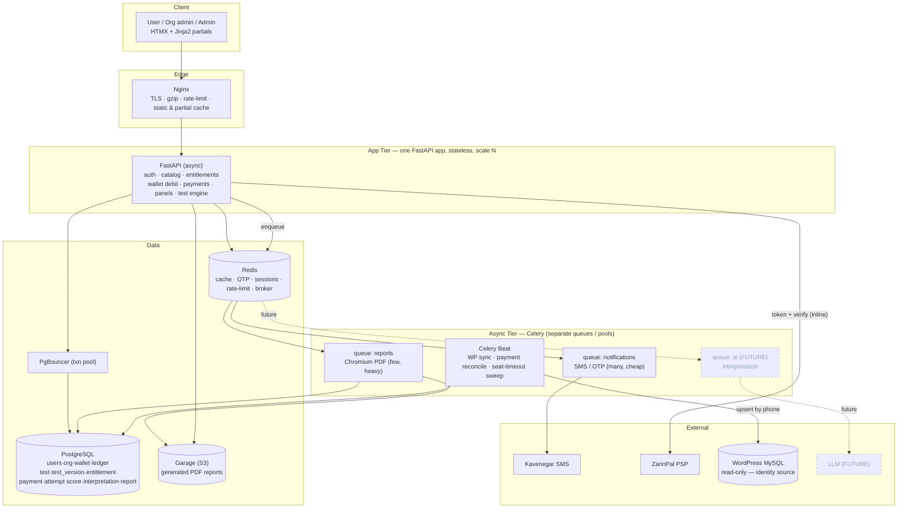
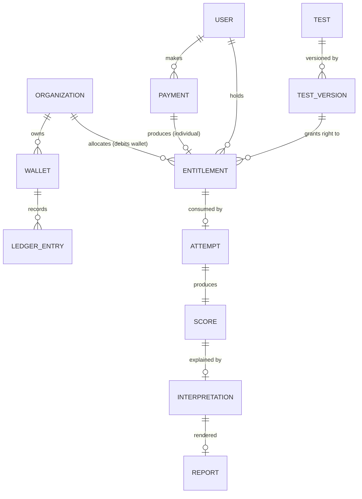
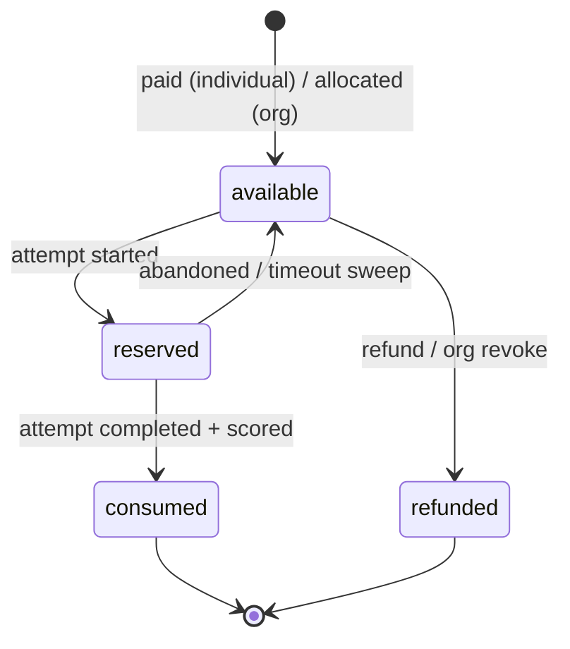

# Psychology Test Platform — Architecture & Implementation Plan

*FastAPI · HTMX · Celery/Redis · PostgreSQL · Garage (S3) · Docker Compose · Nginx*
Scope: small-to-medium scale, one live test (MMPI-Teen-13), built to add more tests, org/individual billing, and AI interpretation later **without rewrites**.

---

## 0. The one change I'm making to your brief — and why

You asked for a **microservice-based** platform but also for *small-to-medium scale*, *not overly complex*, and *clean, simple, readable*. Those two goals pull in opposite directions, so I'm going to be direct: **true microservices would actively damage the goals you care about here.**

Look at what your stack actually lists — one FastAPI app, Celery workers, Redis, Postgres, Garage, Nginx. Those Compose entries are **processes and infrastructure, not business microservices.** Real microservices means separately deployed services each owning their *own database*, talking over the network. For this project that would mean:

- The **wallet/entitlement atomicity** we designed (a single transactional debit) becomes a *distributed transaction* problem — sagas, compensating actions, eventual consistency. This is the single hardest thing to get right in money systems, and microservices make it dramatically harder.
- Operational tax a small team shouldn't pay: service discovery, inter-service auth, network-failure handling, distributed tracing, N deployment pipelines.
- It directly contradicts "not overly complex."

**What you actually want — and what I'm designing — is a **modular monolith** with separate worker processes.** One deployable FastAPI app, internally split into clean modules with hard boundaries (the "seams" we kept talking about), plus Celery workers for slow work. You get everything you asked for — independent scaling of web vs. async work, clean structure, a stateless app tier — *without* the distributed-systems cost. And because the module boundaries are real, if one module ever genuinely needs to become its own service, the seam is already cut.

> **Rule for this codebase:** modules talk to each other through a small set of **service functions**, never by reaching into each other's tables. That discipline is what makes "extract a service later" a possibility instead of a fantasy — and it's the only structural rule you must hold.

Everything below follows from this.

---

## 1. The MMPI, exactly as it scores (verified)

I parsed your `mmpi.html` and reproduced its scoring in Python, then ran **5,000 random respondents through both the original logic and the new engine: zero divergence.** Your scoring is preserved bit-for-bit. What the instrument is:

| Property | Value |
|---|---|
| Items | **130**, binary بله/خیر |
| Scales | **13** (10 items each): `L F K` (validity) · `Hs D Hy Pa Sc Ma Pd Si PK A` (clinical) |
| Reverse-scored | 11 items: `40, 53, 66, 79, 92` (L) · `124, 125, 126, 127, 128, 130` |
| Raw score | non-reverse → بله=1/خیر=0; reverse → بله=0/خیر=1; summed per scale |
| Norms | by **gender** (girl/boy), each scale has `mean`,`sd` |
| T-score | `z = (raw − mean) / sd`; `T = round(50 + 10·z, 2)` (JS `Math.round` half-up) |
| Validity flag | `T > 60` |
| Clinical bands | caution `T ≥ 65` · severe `T ≥ 70` |
| Chart | line, y 20–90, reference lines at T=50/65/70, divider between K and Hs |
| Demographics | **gender (required — selects norm table)**, age, class/grade |

### Generalising to 2 / 4 / 6 choices without touching MMPI

The trick that makes one engine serve every test: **each option carries a weight, and a scale's raw score is the sum of chosen weights.** For MMPI binary that's `{بله:1, خیر:0}` (or reversed) — which reproduces the original exactly. For a 4- or 6-point Likert test it's `{0,1,2,3}` or `{0..5}`. Same engine, same scoring path, no special cases. The extracted `mmpi_v1.json` (shipped alongside this doc) already encodes the 130 items this way.

A critical identity note: WordPress gives you phone/email/username — **not gender.** Because MMPI norms are gender-specific, the test flow must **capture demographics at the start of an attempt.** The test definition declares which demographic field drives the norm group (`gender` here), so the engine stays generic.

---

## 2. System architecture



**The load-bearing principle:** the web tier only ever does fast Postgres/Redis work and *enqueues*; every slow third party (SMS send, PDF render, future LLM) runs in a worker. The one inline external call is **ZarinPal verify**, because the user is mid-redirect waiting for it and it's a quick server-to-server round-trip. That single discipline is what makes 200 req/s a non-event.

### The running processes (this is your whole system)

| Process | What it is | Scale by |
|---|---|---|
| `web` | FastAPI under Uvicorn/Gunicorn | replicas (stateless) |
| `worker-notifications` | Celery, `notifications` queue | replicas |
| `worker-reports` | Celery, `reports` queue (Chromium) | replicas (RAM-bound) |
| `worker-ai` *(later)* | Celery, `ai` queue | replicas (LLM-rate-bound) |
| `beat` | Celery Beat scheduler | exactly 1 |
| `nginx` · `postgres` · `pgbouncer` · `redis` · `garage` | infra | — |

---

## 3. Project structure

A single app package, split into modules with hard boundaries. Workers and web **import the same code** — no duplication.

```
psych-platform/
├── docker-compose.yml
├── docker-compose.prod.yml
├── .env.example
├── nginx/
│   └── nginx.conf
├── app/
│   ├── Dockerfile                 # the app image (web + workers share it)
│   ├── pyproject.toml
│   ├── main.py                    # FastAPI app factory, router mounting
│   ├── config.py                  # pydantic-settings, reads .env
│   ├── db.py                      # async engine, session, Base
│   ├── celery_app.py              # Celery factory, queues, beat schedule
│   ├── deps.py                    # shared FastAPI dependencies (auth, db, csrf)
│   │
│   ├── core/                      # cross-cutting, no business logic
│   │   ├── security.py            # sessions, password/OTP hashing, CSRF
│   │   ├── ratelimit.py           # Redis token-bucket helpers
│   │   ├── errors.py              # error types + handlers (uniform, simple)
│   │   └── templating.py          # Jinja env (RTL, filters, partial helper)
│   │
│   ├── modules/                   # ← the seams. each owns its tables + services
│   │   ├── identity/              # users, orgs, members, WP sync
│   │   │   ├── models.py
│   │   │   ├── service.py         # the ONLY way other modules touch identity
│   │   │   ├── sync.py            # WordPress read-only upsert
│   │   │   └── routes.py          # login (OTP), profile
│   │   ├── billing/               # payments, wallet, ledger, entitlements
│   │   │   ├── models.py
│   │   │   ├── entitlements.py    # reserve / consume / release  (the hinge)
│   │   │   ├── wallet.py          # atomic debit/credit + ledger
│   │   │   ├── payments.py        # ZarinPal request + verify (inline)
│   │   │   └── routes.py          # buy, callback, wallet top-up, org allocate
│   │   ├── catalog/               # tests + versions (definitions/norms)
│   │   │   ├── models.py
│   │   │   ├── service.py         # get_active_version(slug) etc.
│   │   │   └── seed.py            # load mmpi_v1.json → DB
│   │   ├── testing/               # attempts, responses, scoring, interpretation
│   │   │   ├── models.py
│   │   │   ├── engine/
│   │   │   │   ├── scoring.py     # generic, data-driven  (VERIFIED == original)
│   │   │   │   └── interpret.py   # rule-based now; AI later (same output row)
│   │   │   ├── service.py         # start/answer/finish attempt
│   │   │   └── routes.py          # paginated HTMX test flow, results
│   │   ├── reports/               # PDF generation
│   │   │   ├── render.py          # HTML→PDF via Playwright (RTL)
│   │   │   ├── tasks.py           # Celery: generate_report
│   │   │   └── routes.py          # download (signed Garage URL)
│   │   ├── notifications/
│   │   │   ├── sms.py             # Kavenegar client wrapper
│   │   │   └── tasks.py           # Celery: send_sms / send_otp
│   │   └── admin/                 # admin panel (users, tests, payments, sync)
│   │       └── routes.py
│   │
│   ├── templates/                 # Jinja2 (server-rendered HTML + partials)
│   │   ├── base.html              # RTL shell, header/footer, logo slot
│   │   ├── partials/              # HTMX fragments (test page, status, rows…)
│   │   └── ...
│   └── static/
│       ├── css/tokens.css         # the design system (section 9)
│       ├── js/htmx.min.js
│       └── js/chart.umd.min.js
└── tests/                         # pytest (engine equivalence test lives here!)
```

---

## 4. Data model (entitlement-centric)

The unifying primitive is the **entitlement**: the right to one attempt of one test version. Individual payment and org allocation both *produce* one; the test engine only asks "is there a valid one?".



Key tables (essential columns only):

- **users** — `id, phone (unique), email, username, full_name, is_admin, source ('wp'|'local'), wp_user_id, wp_modified_at, created_at`
- **organizations** — `id, name, contact_phone, created_at`
- **org_members** — `org_id, user_id, role ('owner'|'member')` *(PK = both)*
- **wallets** — `id, org_id (unique), balance_cents (>=0), currency, updated_at` — **orgs only; individuals never hold a balance**
- **ledger_entries** — `id, wallet_id, delta_cents, balance_after_cents, reason, ref_type, ref_id, created_at` — **append-only**; balance is always `SUM(delta)` (your clinical customers audit against this)
- **tests** — `id, slug (unique), title, description, price_cents, is_active, created_at`
- **test_versions** — `id, test_id, version, definition (JSONB), is_active, created_at` — the `definition` is the `mmpi_v1.json` shape (scales, norms, questions, thresholds). **Results pin to a version** so a 2026 result stays reproducible after the test is revised.
- **entitlements** — `id, user_id, test_id, test_version_id, status ('available'|'reserved'|'consumed'|'refunded'), source ('payment'|'allocation'), payment_id (nullable), org_id (nullable), created_at, reserved_at, consumed_at`
- **payments** — `id, user_id, kind ('exam'|'wallet_topup'), amount_cents, status ('pending'|'paid'|'failed'), gateway ('zarinpal'), authority, ref_id, idempotency_key (unique), created_at, paid_at`
- **attempts** — `id, entitlement_id (unique), user_id, test_version_id, demographics (JSONB), status ('in_progress'|'completed'), started_at, completed_at`
- **responses** — stored as `responses JSONB` on the attempt (`{question_id: value}`) — simplest, fast, and you never query individual answers relationally
- **scores** — `id, attempt_id (unique), raw (JSONB), t (JSONB), computed_at`
- **interpretations** — `id, attempt_id (unique), source ('rule'|'ai'), body (JSONB), created_at` — **the AI seam: in v1 `source='rule'`; later an AI worker writes `source='ai'` to the same row shape, nothing else changes**
- **reports** — `id, attempt_id (unique), storage_key, status ('pending'|'ready'), created_at`

### The concurrency-critical operation: atomic wallet debit

At 200 req/s two users can start an exam against the last remaining org credit simultaneously. **Never read-then-write balance in Python.** One conditional statement, with the ledger row in the *same transaction*:

```python
# app/modules/billing/wallet.py
from sqlalchemy import text

async def debit_wallet(session, wallet_id: int, cost_cents: int,
                       reason: str, ref_type: str, ref_id: int) -> bool:
    # succeeds ONLY if funds suffice; the WHERE clause is the lock
    row = (await session.execute(text("""
        UPDATE wallets
           SET balance_cents = balance_cents - :cost,
               updated_at = now()
         WHERE id = :wid AND balance_cents >= :cost
        RETURNING balance_cents
    """), {"cost": cost_cents, "wid": wallet_id})).first()
    if row is None:
        return False                      # insufficient funds → caller refuses
    await session.execute(text("""
        INSERT INTO ledger_entries
            (wallet_id, delta_cents, balance_after_cents, reason, ref_type, ref_id, created_at)
        VALUES (:wid, :delta, :bal, :reason, :rt, :rid, now())
    """), {"wid": wallet_id, "delta": -cost_cents, "bal": row.balance_cents,
           "reason": reason, "rt": ref_type, "rid": ref_id})
    return True                            # commit happens in the request's UoW
```

---

## 5. The test engine (generic, data-driven, MMPI-exact)

This is the verified scoring core. It reads a test `definition` (JSONB) and works for any single-choice test with 2/4/6 options.

```python
# app/modules/testing/engine/scoring.py
from __future__ import annotations
import math
from dataclasses import dataclass

def js_round(value: float, ndigits: int) -> float:
    """Faithful to JS Math.round(value*10**n)/10**n (round half toward +inf)."""
    factor = 10 ** ndigits
    return math.floor(value * factor + 0.5) / factor

@dataclass
class ScoreResult:
    raw: dict[str, int]
    t: dict[str, float]

def compute_scores(definition: dict, responses: dict[int, str],
                   demographics: dict) -> ScoreResult:
    scale_order = definition["scale_order"]
    questions = definition["questions"]

    # option weights → raw scale sums (this line generalises 2/4/6 choices)
    weight = {q["id"]: {o["value"]: o["weight"] for o in q["options"]} for q in questions}
    qscale = {q["id"]: q["scale"] for q in questions}
    raw = {s: 0 for s in scale_order}
    for qid, value in responses.items():
        raw[qscale[int(qid)]] += weight[int(qid)][value]

    group = demographics[definition["norm_groups"]["by"]]   # e.g. gender → 'girl'
    norms = definition["norms"][group]
    nd = definition["tscore"]["round_decimals"]
    t = {s: js_round(50 + 10 * ((raw[s] - norms[s]["mean"]) / norms[s]["sd"]), nd)
         for s in scale_order}
    return ScoreResult(raw=raw, t=t)
```

```python
# app/modules/testing/engine/interpret.py  — rule-based now, AI-replaceable later
def interpret(definition: dict, t: dict[str, float]) -> dict:
    out = {"validity": [], "clinical": [], "all_normal": True}
    elevated = 0
    for scale in definition["scales"]:
        k, tv, rule = scale["key"], t[scale["key"]], scale["interpretation"]
        if scale["type"] == "validity":
            flag = tv > rule["elevated_if_t_gt"]                 # MMPI: T > 60
            out["validity"].append({"key": k, "name": scale["name"], "t": tv,
                "elevated": flag, "desc": scale["desc"],
                "text": scale["high"] if flag else None})
        elif tv >= rule["caution_if_t_gte"]:                      # MMPI: T >= 65
            elevated += 1
            out["clinical"].append({"key": k, "name": scale["name"], "t": tv,
                "severity": "severe" if tv >= rule["severe_if_t_gte"] else "caution",
                "desc": scale["desc"], "text": scale["high"]})
    out["all_normal"] = elevated == 0
    return out
```

**Adding a new test later = inserting one `test_versions` row** whose `definition` JSON lists its scales, options+weights, norms, and thresholds. No engine code changes. Lock this in with a test that re-runs the equivalence check (it lives in `tests/` and should run in CI).

---

## 6. Purchase & entitlement flows

Robustness comes from the entitlement state machine, **not** from coupling money to the act of testing. A crash mid-exam just releases the seat back to `available` — no refund, no re-charge.



- **Individual:** `POST /buy/{test}` → create `payment(pending, idempotency_key)` → ZarinPal token → redirect → `/payment/callback` verifies inline → on success create `entitlement(available, source=payment)`.
- **Org wallet top-up:** same payment flow with `kind=wallet_topup`; on verify, `credit_wallet` + ledger entry.
- **Org allocation (assigned model — your "specific users"):** org owner allocates test→named user (by phone); `debit_wallet` + create `entitlement(available, source=allocation, org_id)` in one transaction. Revoke unused → credit back. *(A "pool" variant — N credits any invited user consumes — uses the same primitive; add later if a customer wants it.)*
- **Taking a test:** `start_attempt` flips an `available` entitlement → `reserved` and creates the attempt. `finish_attempt` scores, writes `scores` + `interpretations(source=rule)`, flips entitlement → `consumed`, enqueues the report.
- **Beat sweep:** entitlements `reserved` longer than e.g. 2h with no completed attempt → back to `available`. Pending payments older than X → re-verify or expire.

---

## 7. Integrations

### Kavenegar (SMS / OTP) — off the request path
Wrap the SDK thinly; the **send always runs in the `notifications` worker** so gateway latency never touches a web request.

```python
# app/modules/notifications/tasks.py
from app.celery_app import celery
from app.modules.notifications.sms import send_sms_sync

@celery.task(bind=True, max_retries=3, default_retry_delay=10, queue="notifications")
def send_otp(self, phone: str, code: str):
    try:
        send_sms_sync(phone, template="otp", token=code)   # Kavenegar verify-lookup
    except Exception as exc:
        raise self.retry(exc=exc)
```

OTP login flow: store `code` hashed in Redis with a **120s TTL** *before* enqueueing the SMS; verify against Redis. **Rate-limit hard** (Redis token bucket): 1 SMS / 60s per phone, 5 / hour per phone, plus a per-IP cap — without this an attacker drains your SMS credit and spams real people.

### ZarinPal (payment) — verify inline, idempotent callback
Standard request → redirect → **server-to-server verify**. The non-negotiables: **never trust the redirect; always verify; make the callback idempotent** (PSPs double-fire). The unique `idempotency_key` on `payments` and a status check make re-delivered callbacks safe.

```python
# app/modules/billing/payments.py  (sketch)
async def start_payment(session, user, amount, kind, description, callback_url):
    payment = await create_payment(session, user.id, amount, kind)   # pending
    authority, url = await zarinpal_request(amount, description, callback_url,
                                            metadata={"mobile": user.phone})
    payment.authority = authority
    return url                                   # → RedirectResponse to ZarinPal

async def verify_callback(session, authority, status):
    payment = await get_by_authority(session, authority)
    if payment is None or payment.status != "pending":
        return payment                           # idempotent: already handled
    if status != "OK":
        payment.status = "failed"; return payment
    ref_id = await zarinpal_verify(authority, payment.amount_cents)   # inline S2S
    payment.status, payment.ref_id, payment.paid_at = "paid", ref_id, now()
    # then: create entitlement (exam) OR credit wallet (topup) in THIS transaction
    return payment
```

Both SDKs' exact request/response field names should be confirmed against the repos you linked when we implement — the shapes above are the standard ZarinPal/Kavenegar patterns.

---

## 8. WordPress sync (read-only, safe, scheduled + manual)

MySQL stays **entirely out of the request path.** A Beat job (every few minutes) reads `wp_users` + `wp_usermeta` over a **read-only** connection and **upserts into Postgres keyed on phone**, using an incremental high-water mark so you never full-scan.

```python
# app/modules/identity/sync.py  (sketch)
async def sync_wordpress(full: bool = False) -> dict:
    since = None if full else await get_sync_cursor()      # stored high-water mark
    rows = await read_wp_users(since)   # SELECT id, user_email, user_login,
                                        # meta(phone), user_registered/modified
                                        # WHERE modified > :since  (read-only conn)
    upserted = 0
    for r in rows:
        if not r.phone:                 # phone is the join key; skip if absent
            continue
        await upsert_user_by_phone(phone=r.phone, email=r.user_email,
                                   username=r.user_login, wp_user_id=r.id,
                                   wp_modified_at=r.modified)
        upserted += 1
    await set_sync_cursor(max_modified(rows))
    return {"read": len(rows), "upserted": upserted}
```

- **Scheduled:** Beat entry every N minutes (incremental).
- **Manual:** an admin-panel button → `POST /admin/sync` enqueues the same task; the page polls a tiny status partial via HTMX.
- **Only three fields** are read (phone, email, username) + the WP id/timestamp for incremental sync. **One-way** (WP → app) is the default and far simpler; we only add conflict rules if you later want app→WP writeback.
- **Safe:** read-only DB credentials, the sync never deletes app users, and an upsert is naturally re-runnable.

---

## 9. Frontend — HTMX, clinical, RTL, your green

**No SPA.** FastAPI returns server-rendered HTML; HTMX swaps fragments. Your wire format is mostly HTML, with a tiny JSON surface only for things like attempt-status polling. This keeps the test definitions/questions cacheable and the whole thing fast.

### Design system derived from your brand `#00a379`

A calm clinical surface anchored on your green, with **severity colors that encode the T-score bands** (not decoration — caution = T≥65, severe = T≥70, exactly your existing logic). Typeface stays **Vazirmatn** — it's the right modern Persian face and you already use it; personality comes from weight and generous whitespace, not a second display font that might render Persian poorly.

```css
/* app/static/css/tokens.css */
:root{
  --brand:#00a379; --brand-600:#008f6a; --brand-700:#00795a;   /* text on white */
  --brand-50:#e9f8f3; --brand-100:#cdeee2;
  --ink:#0f172a; --body:#334155; --muted:#64748b; --line:#e6ebef;
  --surface:#ffffff; --canvas:#f5f8f8;                          /* faint green-grey */
  --ok:#00a379;
  --caution:#b45309; --caution-bg:#fef6e7;                      /* T >= 65 */
  --severe:#b91c1c;  --severe-bg:#fdecec;                       /* T >= 70 */
  --radius:16px; --shadow:0 1px 2px rgba(15,23,42,.04),0 8px 24px -12px rgba(15,23,42,.12);
  --space:clamp(16px,2vw,28px);
}
html{font-family:'Vazirmatn',system-ui,sans-serif}
body{background:var(--canvas);color:var(--body);direction:rtl}
.card{background:var(--surface);border:1px solid var(--line);
      border-radius:var(--radius);box-shadow:var(--shadow);padding:var(--space)}
h1,h2,h3{color:var(--ink);font-weight:700;letter-spacing:-.01em}
.btn{background:var(--brand);color:#fff;border-radius:12px;padding:.7rem 1.2rem;
     font-weight:700;border:0;transition:background .15s}
.btn:hover{background:var(--brand-600)} .btn:active{background:var(--brand-700)}
.btn:focus-visible{outline:3px solid var(--brand-100);outline-offset:2px}
```

`base.html`: RTL shell, sticky header with a **logo slot** (`` → drop your SVG/PNG later), generous max-width (~`64rem`) content column, and a **footer** on every page.

### Paginated test, the HTMX way

10 questions per page (matching the original). Answers post per page; the server validates and returns the next page fragment. State (current answers) lives **server-side on the attempt** — so a refresh or device switch never loses progress, and the app tier stays stateless.

```html
<!-- templates/partials/test_page.html -->
<form hx-post="/attempt/{{ attempt.id }}/page/{{ page }}"
      hx-target="#test-area" hx-swap="innerHTML">
  <div class="progress"><span style="width: {{ pct }}%"></span></div>
  
    <fieldset class="q card">
      <legend><span class="num">{{ q.id }}</span> {{ q.text }}</legend>
                  {# 2, 4 or 6 — same template #}
        <label class="opt">
          <input type="radio" name="q-{{ q.id }}" value="{{ opt.value }}"
                 checked required>
          <span>{{ opt.label }}</span>
        </label>
      
    </fieldset>
  
  <div class="nav">
    <button name="dir" value="prev" class="btn ghost">صفحه قبل</button>
    <button name="dir" value="next" class="btn">صفحه بعد</button>
    <button name="dir" value="finish" class="btn">اتمام و محاسبه پروفایل</button>
  </div>
</form>
```

### Result chart with Chart.js (faithful to the original)
Reuse your exact chart: line, y-axis 20–90, the T=50/65/70 reference lines, the K↔Hs divider, validity vs clinical series. Render it from the on-page `scores` JSON. (For the PDF, the same chart is produced server-side — see §10.) Interpretations render as short blocks colored by `severity` (ok/caution/severe) — concise by default.

---

## 10. Reports (beautiful, RTL, async)

Render an **HTML/CSS template with headless Chromium (Playwright)** → PDF. Chromium gives real CSS, correct RTL, and embedded Vazirmatn — far better Persian output than WeasyPrint. Runs in the dedicated **`reports` worker** (Chromium is RAM-hungry, hence isolated).

```python
# app/modules/reports/tasks.py
@celery.task(queue="reports", max_retries=2)
def generate_report(attempt_id: int):
    data = load_report_data(attempt_id)            # profile, scores, interpretation
    html = render_template("report/pdf.html", **data)  # same tokens, print CSS
    pdf = html_to_pdf(html)                         # Playwright: set_content → pdf()
    key = f"reports/{attempt_id}.pdf"
    put_object(key, pdf)                            # → Garage (S3)
    mark_report_ready(attempt_id, key)
    enqueue_send_sms(user_phone(attempt_id), "result_ready")
```

Chart in the PDF: either render Chart.js inside the Playwright page (it executes JS), or pre-render to an image — both work; the in-page route keeps one source of truth for the chart. Serve downloads via **short-lived Garage signed URLs**. The result page polls `GET /attempt/{id}/report-status` (tiny HTML partial) and reveals the download link when `ready`.

---

## 11. Config & security

**Config** — one typed settings object, everything from `.env`:

```python
# app/config.py
from pydantic_settings import BaseSettings
class Settings(BaseSettings):
    database_url: str; pgbouncer_url: str | None = None
    redis_url: str
    secret_key: str; session_ttl: int = 1209600
    garage_endpoint: str; garage_key: str; garage_secret: str; garage_bucket: str
    kavenegar_api_key: str; kavenegar_otp_template: str
    zarinpal_merchant_id: str; zarinpal_sandbox: bool = False
    wp_mysql_url: str                       # READ-ONLY mysql account
    otp_ttl: int = 120
    class Config: env_file = ".env"
settings = Settings()
```

**Security checklist (health-adjacent data — treat it seriously):**
- Sessions in Redis (HTTP-only, Secure, SameSite cookies); CSRF tokens on every mutating form.
- OTP hashed in Redis, short TTL, hard rate-limits per phone + IP.
- Authorization: a user sees only their attempts/results; an org owner only their org; admin gated. Enforce in `service.py`, not templates.
- Payment callback idempotent + amount re-checked on verify.
- **Encrypt sensitive columns at rest** (responses, raw/t scores, interpretation) — app-level (e.g. Fernet via a KMS/Infisical-held key) or Postgres `pgcrypto`.
- **Audit log** every result/report access.
- PII scrubbed from logs; secrets only via env/Infisical, never in the image.
- Nginx: TLS, security headers, body-size limit, basic rate-limit at the edge too.
- WordPress credentials are **read-only**.

**Performance/scale knobs:** async everywhere (asyncpg + async SQLAlchemy + httpx); **PgBouncer in transaction mode** so replicas×workers don't exhaust `max_connections`; cache test definitions/questions/norms in Redis (rarely change → hot path skips Postgres); stateless app → scale by adding `web` replicas; watch **Celery queue depth** as the real backpressure signal for workers.

---

## 12. Docker Compose & deployment

One app image, run as several services. Workers and web differ only by command.

```yaml
# docker-compose.yml (dev shape; prod overlay tightens it)
x-app: &app
  build: ./app
  env_file: .env
  depends_on: [postgres, redis, garage]

services:
  web:
    <<: *app
    command: gunicorn app.main:app -k uvicorn.workers.UvicornWorker -w 4 -b 0.0.0.0:8000
    expose: ["8000"]

  worker-notifications:
    <<: *app
    command: celery -A app.celery_app worker -Q notifications -c 8 --loglevel=info

  worker-reports:
    <<: *app
    command: celery -A app.celery_app worker -Q reports -c 2 --loglevel=info
    # Chromium deps live in the image; this pool is memory-bound → low concurrency

  beat:
    <<: *app
    command: celery -A app.celery_app beat --loglevel=info

  nginx:
    image: nginx:1.27-alpine
    volumes: ["./nginx/nginx.conf:/etc/nginx/nginx.conf:ro",
              "./app/static:/static:ro"]
    ports: ["80:80", "443:443"]
    depends_on: [web]

  postgres:
    image: postgres:16-alpine
    environment: {POSTGRES_DB: psych, POSTGRES_PASSWORD: ${PG_PASSWORD}}
    volumes: ["pgdata:/var/lib/postgresql/data"]

  pgbouncer:
    image: edoburu/pgbouncer:latest
    environment: {DATABASE_URL: ${DATABASE_URL}, POOL_MODE: transaction}
    depends_on: [postgres]

  redis:
    image: redis:7-alpine
    command: ["redis-server","--appendonly","yes","--maxmemory-policy","noeviction"]
    volumes: ["redisdata:/data"]

  garage:
    image: dxflrs/garage:v1.0.1
    volumes: ["./garage.toml:/etc/garage.toml:ro","garagedata:/var/lib/garage"]

volumes: {pgdata: {}, redisdata: {}, garagedata: {}}
```

> `worker-ai` is intentionally **absent** — it's added as one more service block (same image, `-Q ai`) the day you turn on AI interpretation. Nothing else in this file changes.

App `Dockerfile` highlights: Python 3.12-slim base; install deps; for the **same image to run report workers**, install Playwright + Chromium (`playwright install --with-deps chromium`). If image size becomes a concern, split a `reports` image later — but one image is simpler to start, per your brief.

`nginx.conf`: terminate TLS, gzip, serve `/static` directly, proxy everything else to `web`, add a `limit_req` zone for `/login`/OTP, and cache GET partials for test definitions.

**Nightly:** `pg_dump` to Garage. **Scaling:** `docker compose up -d --scale web=3 --scale worker-notifications=2`. (Compose is right for small-to-medium; the modular structure ports cleanly to Kubernetes later if you outgrow it.)

---

## 13. Phased implementation plan

Each milestone is shippable and testable on its own. Money and child-relevant data are deliberately late, behind hardening.

| Phase | Deliverable | Notes |
|---|---|---|
| **0 — Skeleton** | Compose up (web/redis/postgres/garage/nginx), config, db, Alembic, `base.html` + tokens, health check | The frame everything hangs on |
| **1 — Catalog + Engine** | Load `mmpi_v1.json`; `scoring.py` + `interpret.py`; **equivalence test in CI** | Pure logic, no auth — verify scoring first |
| **2 — Identity + OTP** | Users table, Kavenegar wrapper, OTP login via `notifications` worker, sessions, rate-limits | Real login |
| **3 — WP Sync** | Read-only reader, upsert-by-phone, Beat schedule + admin manual button | Identity flows in |
| **4 — Test flow** | Start/answer (paginated HTMX)/finish attempt, server-side progress, results page + Chart.js | The product's core, end to end — *but entitlement check stubbed "always allow" until Phase 5* |
| **5 — Billing** | Entitlements (reserve/consume/release), ZarinPal individual purchase, org wallet + ledger + allocation, atomic debit, Beat sweeps | Wire the real entitlement gate into Phase 4 |
| **6 — Reports** | Playwright PDF (RTL), Garage storage, signed URLs, status polling, "result ready" SMS | The `reports` worker |
| **7 — Admin panel** | Users, tests/versions, payments view, sync control, audit log view | Operations |
| **8 — Hardening** | Column encryption, audit logging, security headers, load test to 200 req/s, backups | Before real clinical data |
| **Later — AI** | `ai` queue + worker writing `interpretations(source='ai')`; Langfuse traces; guardrails (explain, don't diagnose) | **Zero web/schema change — the seam already exists** |

**Suggested build order to start:** Phase 0 → 1 → 4 (with stubbed entitlement) gets you a working, scoreable MMPI you can click through and verify against the original *before* any money or auth complexity — the fastest path to "it works," and the safest way to confirm the scoring is faithful in the real UI.

---

### What I'd want from you to start building concretely
1. The **Kavenegar** OTP template name + whether you use the verify-lookup (template) API or plain send.
2. The **ZarinPal** mode (sandbox vs. live) + merchant id, and confirmation of the redirect/callback URLs.
3. Where the **phone number lives in `wp_usermeta`** (the meta_key) — it varies by plugin.
4. Your **logo** (SVG ideal) and any header wording.

Tell me which phase to implement first and I'll generate that module's real code — models, routes, templates, tasks — against this structure.
